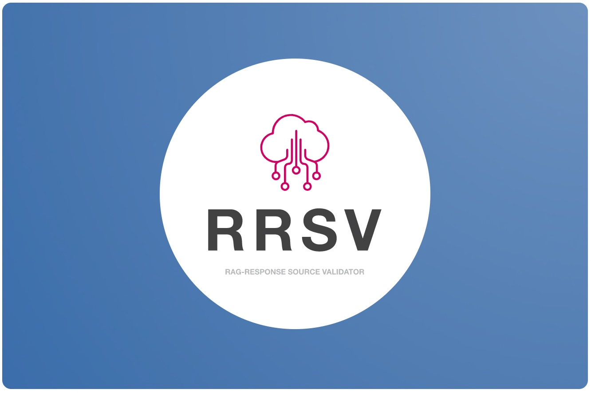

# RRSV - A RAG LLMs response with Source Data Validation by using Open AI, Python, Glove & FAISS



## About this package

This new solution will expose a controlled platform for an end-end LLMs that feed source data validation with RAG implementation. I'll also use OpenAI python-based SDK and Glove embeddings in this case. This application developed using openai, Python, FAISS & Glove for vector embeddings. This project is for the advanced Python developer & Data Science Newbi's.


## How to use this package

(The following instructions apply to Posix/bash. Windows users should check
[here](https://docs.python.org/3/library/venv.html).)

First, clone this repository and open a terminal inside the root folder.

Create and activate a new virtual environment (recommended) by running
the following:

```bash
python3 -m venv venv
source venv/bin/activate
```

Install the requirements:

```bash
pip install -r requirements.txt
```

Run the Vector embedding application, which will convert the source data into vector embeddings:

```bash
python 1_createVectorEmbedding.py
```

Let's run the main RAG application, which will provide the Open AI response from the source data with the source data as reference for response validations -

```bash
python 2_testRAGOpenAI.py
```

Please find the some of the important dependent package -

```

pip install openai==0.27.8
pip install pandas==2.0.3
pip install tensorflow==2.11.1
pip install faiss-cpu==1.7.4
pip install gensim==4.3.2

```

Install the above requirements.

Note that the debug indicator is set to "Y". This will generate logs. If you change this to 'N'. No logs will be generated. However, the process will be faster.

## Screenshots


## Resources

- To view the complete demo with sound, check out our [YouTube Page](https://youtu.be/Odtv_4YeB2g).
- To view on Python, check out the [Python Page](https://docs.python.org/3/).
- To view more on the OpenAI, check out this [OpenAI Official Page](https://platform.openai.com/examples).
- To view more on the GloVe, check out this [GloVe Official Page](https://nlp.stanford.edu/projects/glove/).
